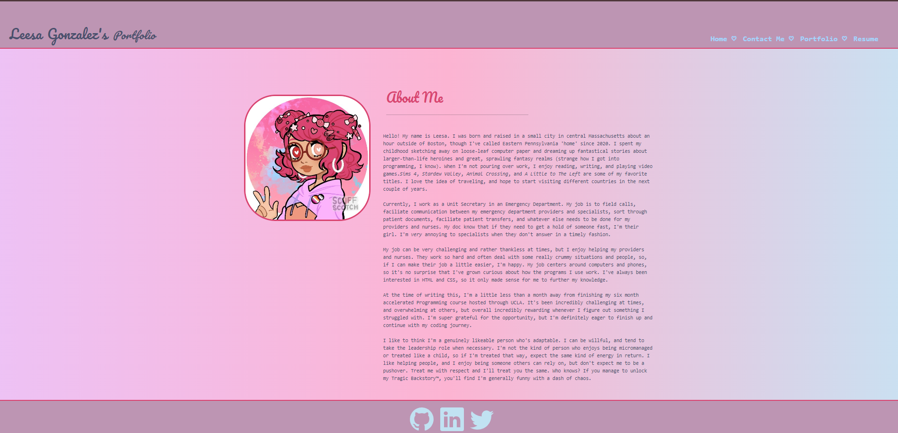
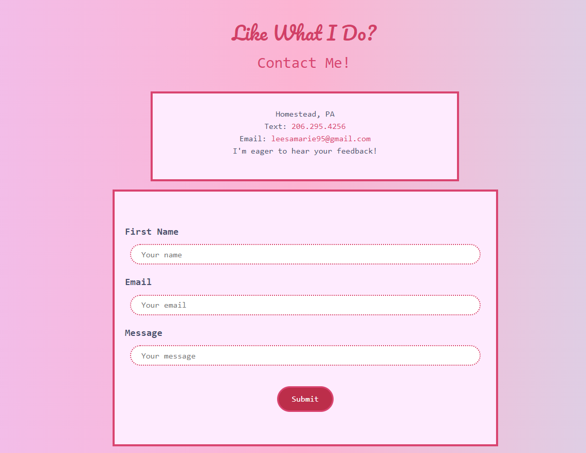

# React-Portfolio

## Description
This application is my personal portfolio of work with a section to get to know me better, see some of my best work, and contact me! This application is built through React with a server-side and client-side branches that work together to work as a cohesive unit. Users will be able to click through the navigation links and browse through my About Me, and, using the static images on the Portfolio page, be sent straight to the repository of the application where the code and deployed applications are held. 

If a user finds that they like my work and want to know what skills I currently have under my belt, they can click over to the 'Resume' section and see my skills arranged by front-end and back-end programming, as well as have the ability to download my resume to get a better idea of my work history. 

Finally, if they find they like my work and what I can do, a user can send me a message via the Contact Me page. 

## Installation
This application doesn't need anything to be downloaded onto a user's device. All you'll need is the link to the application. 

The link to the deployed application can be found <a href="https://leesamarieportfolio.netlify.app/About">Here</a>

## Visuals
Here are some nifty screenshots of the site for your viewing pleasure. Beware: it is Very Pink.

## Support
If you find that the site has decided it's taken a long walk off a short pier straight into the Bug Bog, please feel free to get a hold of me and hopefully I can figure out what the problem is. My email is `leesamarie95@gmail.com`, or you can shoot me a message here on GitHub!

## License
Copyright (c) 2024 LeesaM95

Permission is hereby granted, free of charge, to any person obtaining a copy
of this software and associated documentation files (the "Software"), to deal
in the Software without restriction, including without limitation the rights
to use, copy, modify, merge, publish, distribute, sublicense, and/or sell
copies of the Software, and to permit persons to whom the Software is
furnished to do so, subject to the following conditions:

The above copyright notice and this permission notice shall be included in all
copies or substantial portions of the Software.

## Acknowledgments
I know I sound like a broken record at this point, but I really am grateful for every person who's given me help over these grueling six months. Every programmer who's repository I've referenced when I was extremely stuck, my teachers who put up with staying on Zoom calls well passed the appointed hour, and my fellow classmates who always had a kind word or a helpful tip for me to follow. I literally would not have gotten this far without them. 

